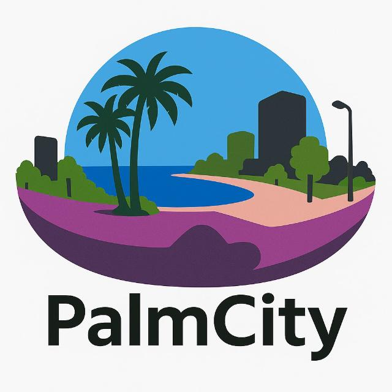

<div align="center">

# 

### A Benchmark Dataset for Semantic Segmentation of Panoramic Urban Street View Images

**Urban Scene Understanding • Panoramic Street View Imagery • Semantic Segmentation • GeoAI**

[Project Website](https://palmcity-dataset.com/)  [Download Dataset](https://drive.google.com/drive/folders/1CKUzdQ8Tm74A6hHXWGd37NEI1JqTU7Jp)  [Paper](https://link.springer.com/chapter/10.1007/978-3-031-97663-6_14)

---

**PalmCity** is a large-scale urban scene understanding dataset designed for semantic segmentation of panoramic street-level imagery, with a particular focus on urban environments that are under-represented in conventional computer vision benchmarks.

The dataset was collected in **Mersin, Türkiye**, and provides detailed pixel-level semantic annotations covering transportation infrastructure, buildings, vegetation, street furniture, vehicles, pedestrians, and other elements of the urban environment.

</div>

---

## About PalmCity

Existing urban scene understanding datasets such as Cityscapes have played a central role in the development of semantic segmentation algorithms. However, models trained predominantly on cities from developed countries may not fully represent the architectural characteristics, street morphology, transportation patterns, vegetation, street furniture, and heterogeneous urban structures encountered in other geographic regions.

PalmCity was developed to help address this gap.

The dataset provides densely annotated panoramic street-view imagery representing the visual and semantic complexity of a Mediterranean urban environment in Türkiye. It is intended to support research on:

- Semantic segmentation
- Urban scene understanding
- Panoramic image analysis
- GeoAI and urban analytics
- Domain adaptation and domain generalization
- Cross-dataset evaluation
- Urban morphology analysis
- Street-level environmental indicators

PalmCity can also be used to investigate the transferability of models trained on established benchmarks such as Cityscapes and ADE20K to geographically distinct urban environments.

---

## 📊 Dataset Characteristics

| Property | PalmCity |
|---|---|
| Location | Mersin, Türkiye |
| Image Type | Panoramic Street View Imagery |
| Acquisition | 360° street-level imaging |
| Primary Task | Semantic Segmentation |
| Annotation Type | Dense pixel-level semantic masks |
| Number of Classes | **32 semantic classes** |
| Number of Images | `830` |
| Training Images | `497` |
| Validation Images | `84` |
| Test Images | `249` |
| Image Resolution | `1024x512` |
| Geographic Context | Mediterranean / developing-country urban environment |

---

## 🎨 Semantic Classes

PalmCity contains **32 semantic classes** representing major components of the urban environment.

<table>
<thead>
<tr>
<th align="center">ID</th>
<th align="center">Category</th>
<th align="center">Class</th>
<th align="center">Color</th>
</tr>
</thead>
<tbody>
<tr>
<td align="center">0</td>
<td align="center" rowspan="4"><b>Flat Surface</b></td>
<td align="center">Road</td>
<td align="center"></td>
</tr>
<tr>
<td align="center">1</td>
<td align="center">Sidewalk</td>
<td align="center"></td>
</tr>
<tr>
<td align="center">2</td>
<td align="center">Parking Lot</td>
<td align="center"></td>
</tr>
<tr>
<td align="center">3</td>
<td align="center">Soil</td>
<td align="center"></td>
</tr>
<tr>
<td align="center">4</td>
<td align="center" rowspan="2"><b>Person</b></td>
<td align="center">Pedestrian</td>
<td align="center"></td>
</tr>
<tr>
<td align="center">5</td>
<td align="center">Driver</td>
<td align="center"></td>
</tr>
<tr>
<td align="center">6</td>
<td align="center" rowspan="5"><b>Vehicle</b></td>
<td align="center">Car</td>
<td align="center"></td>
</tr>
<tr>
<td align="center">7</td>
<td align="center">Truck</td>
<td align="center"></td>
</tr>
<tr>
<td align="center">8</td>
<td align="center">Bus</td>
<td align="center"></td>
</tr>
<tr>
<td align="center">9</td>
<td align="center">Motorcycle</td>
<td align="center"></td>
</tr>
<tr>
<td align="center">10</td>
<td align="center">Bicycle</td>
<td align="center"></td>
</tr>
<tr>
<td align="center">11</td>
<td align="center" rowspan="8"><b>Object</b></td>
<td align="center">Traffic Light</td>
<td align="center"></td>
</tr>
<tr>
<td align="center">12</td>
<td align="center">Traffic Sign</td>
<td align="center"></td>
</tr>
<tr>
<td align="center">13</td>
<td align="center">Pole</td>
<td align="center"></td>
</tr>
<tr>
<td align="center">14</td>
<td align="center">Garbage Box</td>
<td align="center"></td>
</tr>
<tr>
<td align="center">15</td>
<td align="center">Sitting Bench</td>
<td align="center"></td>
</tr>
<tr>
<td align="center">16</td>
<td align="center">Infrastructure Cover</td>
<td align="center"></td>
</tr>
<tr>
<td align="center">17</td>
<td align="center">Infrastructure Box</td>
<td align="center"></td>
</tr>
<tr>
<td align="center">18</td>
<td align="center">Parking Barrier</td>
<td align="center"></td>
</tr>
<tr>
<td align="center">19</td>
<td align="center" rowspan="6"><b>Construction</b></td>
<td align="center">Building</td>
<td align="center"></td>
</tr>
<tr>
<td align="center">20</td>
<td align="center">Wall</td>
<td align="center"></td>
</tr>
<tr>
<td align="center">21</td>
<td align="center">Fence</td>
<td align="center"></td>
</tr>
<tr>
<td align="center">22</td>
<td align="center">Stairs</td>
<td align="center"></td>
</tr>
<tr>
<td align="center">23</td>
<td align="center">Railing</td>
<td align="center"></td>
</tr>
<tr>
<td align="center">24</td>
<td align="center">Overpass</td>
<td align="center"></td>
</tr>
<tr>
<td align="center">25</td>
<td align="center"><b>Water Surface</b></td>
<td align="center">Water Surface</td>
<td align="center"></td>
</tr>
<tr>
<td align="center">26</td>
<td align="center"><b>Sky</b></td>
<td align="center">Sky</td>
<td align="center"></td>
</tr>
<tr>
<td align="center">27</td>
<td align="center" rowspan="3"><b>Green Area</b></td>
<td align="center">Tree</td>
<td align="center"></td>
</tr>
<tr>
<td align="center">28</td>
<td align="center">Grass</td>
<td align="center"></td>
</tr>
<tr>
<td align="center">29</td>
<td align="center">Pruned Tree</td>
<td align="center"></td>
</tr>
<tr>
<td align="center">30</td>
<td align="center"><b>Operator and Shadow</b></td>
<td align="center">Operator and Shadow</td>
<td align="center"></td>
</tr>
<tr>
<td align="center">31</td>
<td align="center"><b>Void</b></td>
<td align="center">Void</td>
<td align="center"></td>
</tr>
</tbody>
</table>

---

## 🖼️ Sample Annotations

<table>
  <tr>
    <th width="50%">Panoramic Image</th>
    <th width="50%">Ground-Truth Annotation</th>
  </tr>

  <tr>
    <td>
      
    </td>
    <td>
      
    </td>
  </tr>

  <tr>
    <td>
      
    </td>
    <td>
      
    </td>
  </tr>

  <tr>
    <td>
      
    </td>
    <td>
      
    </td>
  </tr>
</table>

---

## 📁 Dataset Structure

```text
PalmCity/
│
├── images/
│   ├── train/
│   ├── val/
|   ├── test/
│
├── annotations/
|   ├── cityscapes/
|     ├── train/
│     ├── val/
|   ├── coco/
|     ├── train/
│     ├── val/
|   ├── gt/
│     ├── train/
│     ├── val/
|   ├── voc/
|     ├── train/
│     ├── val/
│
```

Each semantic annotation image contains the pixel-wise class labels corresponding to its associated panoramic RGB image. 'gt' folder includes annotation images. For support reproducility, we also share various annotation formats such as cityscapes, coco, and voc. Test annotations will be released after the challenge. 

---

## ⬇️ Download

The PalmCity dataset can be downloaded from the link given below.

**[PalmCity Dataset](https://drive.google.com/drive/folders/1CKUzdQ8Tm74A6hHXWGd37NEI1JqTU7Jp)**
---

## 🧠 Benchmark

PalmCity is intended to serve not only as a dataset but also as a benchmark for urban semantic segmentation.

The benchmark evaluates some representative CNN- and Transformer-based semantic segmentation architectures.

| Model | Backbone | mIoU (%) | mF-1 Score (%) |
|:---:|:---:|:---:|:---:|
| FCN | `ResNet101` | `46.02` | `56.96` |
| PSPNet | `ResNet50` | `33.35` | `42.48` |
| DeepLabV3+ | `ResNet50` | `42.23` | `52.40` |

Detailed benchmark configurations and pretrained models will be released after the challenge.

---

## 🌍 Why PalmCity?

Computer vision datasets inevitably reflect the environments in which they were collected.

Urban segmentation benchmarks developed primarily from European, North American, or other highly represented environments may not sufficiently capture the visual characteristics of cities with different architectural styles, street layouts, vegetation patterns, infrastructure, transportation behaviour, and urban morphology.

PalmCity provides a geographically distinct benchmark for studying this problem.

The dataset therefore enables researchers to investigate:

**Cross-city generalization**

**Cross-domain robustness**

**Dataset-specific training**

**Multi-dataset learning**

---

## 📝 Citation

If you use PalmCity in your research, please cite:

```bibtex
@inproceedings{palmcity2026,
  title     = {PalmCity: An Emerging Benchmark Dataset for Semantic Segmentation
               of Panoramic Street View Images in Under-Represented
               Developing Countries},
  author    = {Iban, Muzaffer Can and
               Bayrak, Onur Can and
               Kartal, Serkan and
               Ilmak, Dogu and
               Seker, Dursun Zafer},
  booktitle = {Computational Science and Its Applications -- ICCSA 2025 Workshops},
  series    = {Lecture Notes in Computer Science},
  volume    = {15899},
  pages     = {165--175},
  publisher = {Springer},
  year      = {2026},
  doi       = {10.1007/978-3-031-97663-6_14}
}
```

---


---

## 📜 License

PalmCity is released for research and academic use.

---

## 🤝 Contributing

We welcome reports regarding, including but not limited to:

- Dataset loading problems
- Evaluation issues
- Documentation
- Benchmark reproduction

---

## 📬 Contact

For questions related to PalmCity, dataset access, licensing, or research collaboration:


Contact:  
`admin@palmcity-dataset.com`

---

<div align="center">

### 🌴 PalmCity

**Understanding cities beyond conventional benchmarks.**

Panoramic Street View Imagery · Semantic Segmentation · GeoAI · Urban Analytics

</div>

---

## Funding

This work was supported by the Scientific and Technological Research Council of Türkiye (TÜBİTAK) through the **3501 Career Development Program** under Project No. **124Y224**.
